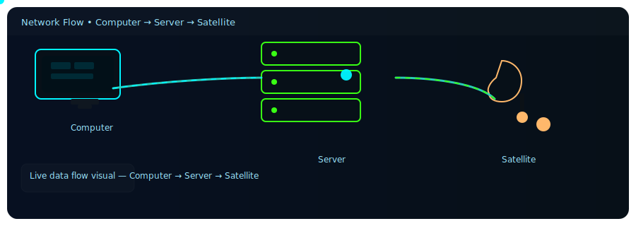

<!-- 💻 S2zxx0zxx — Ultra Pro GitHub Profile -->

  

<h1 align="center">
  
</h1>

---

### 🚀 About Me
💡 Passionate **Full-Stack Developer** and **AI Automation Engineer** with deep expertise in crafting intelligent systems, cross-platform apps, and automation pipelines.  
I build modern digital products that are smart, scalable, and beautifully efficient.

---

### 🧠 Languages & Framework Expertise

#### 🐍 **Python**
- Used for **AI automation**, **backend scripting**, and **data analytics**
- Experienced with **Flask**, **OpenAI API**, and **stock/finance APIs**
- Powers backend logics, automation tasks, and smart integrations

#### ⚡ **JavaScript (JS)**
- For interactive **frontend logic**, **dynamic UIs**, and **API communication**
- Mastered **ES6+**, async workflows, and modular JS architecture

#### ⚛️ **React JS + Vite**
- High-speed **SPAs** using **Tailwind CSS**, **Framer Motion**, and **Vite**
- Sleek UI, responsive design, and real-time component updates

#### 🧱 **Node.js + Express**
- Backend for **REST APIs**, **auth systems**, and **real-time connections**
- Integrated with **Firebase** and **Python AI pipelines**

#### 🧠 **TypeScript**
- Type-safe structure for **SEO**, **automation**, and **AI dashboards**

#### 🎯 **Dart + Flutter**
- Built **cross-platform mobile apps** (Android + iOS)
- Integrated **Firebase Auth**, **Firestore**, **Cloud Functions**

#### 🌐 **HTML + CSS**
- Core of responsive web structure using **Flexbox**, **Grid**, and **Tailwind**

#### 🔥 **Firebase**
- Real-time **database**, **auth**, and **cloud integration**
- Backend-as-a-Service for web and mobile sync

#### ⚙️ **N8N + Workflow Automation**
- Automated **AI tasks**, **Google Sheets**, **custom APIs**
- Built self-running digital automation systems

---

##### 💎 Tech Stack

  

### 🧩 Tools & DevOps
| Category | Tools |
|-----------|-------|
| **Version Control** | Git, GitHub |
| **Deployment** | Vercel, Render, Netlify |
| **E-Commerce** | Shopify, API automation |
| **Automation** | N8N, Zapier, Python |
| **Database** | Firebase, SQLite, JSON |
| **IDE & Tools** | VS Code, Postman |

---

### 💪 Core Strengths
✅ Clean architecture & scalable logic  
✅ API integration & automation  
✅ Web + Mobile (cross-platform) development  
✅ Secure, optimized backend  
✅ AI-driven system design  
✅ Animated UI/UX precision  

---

### 📊 GitHub Insights

  
  

  

---

### 🏆 GitHub Trophies

  

---

### 🧰 Skills Snapshot
**Python** ▰▰▰▰▰▰▰▱▱▱ 80%  
**JavaScript** ▰▰▰▰▰▰▰▰▰▱ 90%  
**React / Vite** ▰▰▰▰▰▰▰▰▱▱ 85%  
**Node.js / Express** ▰▰▰▰▰▰▰▰▱▱ 85%  
**Flutter / Dart** ▰▰▰▰▰▰▰▱▱▱ 75%  
**Firebase / Automation** ▰▰▰▰▰▰▰▰▰▱ 90%

---

### ⚡ Tagline By Satzzxzxx 
> 💬 *Building Smart Systems, Scalable Platforms & Intelligent Automation — One Line of Code at a Time.*

---

  

  

  

---

### 🌍 Connect With Me

---

<h3 align="center">
  
</h3>
