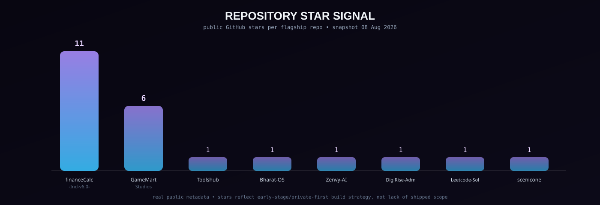
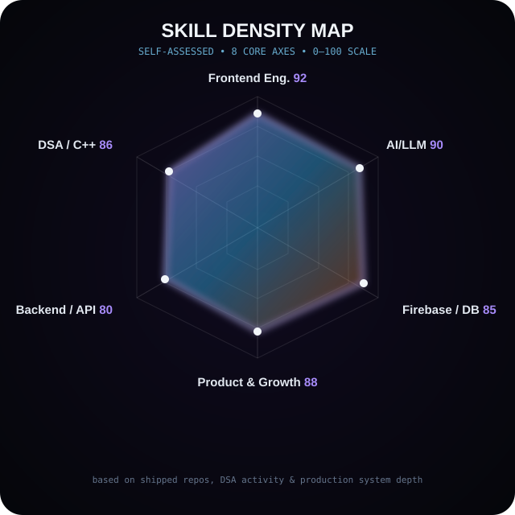
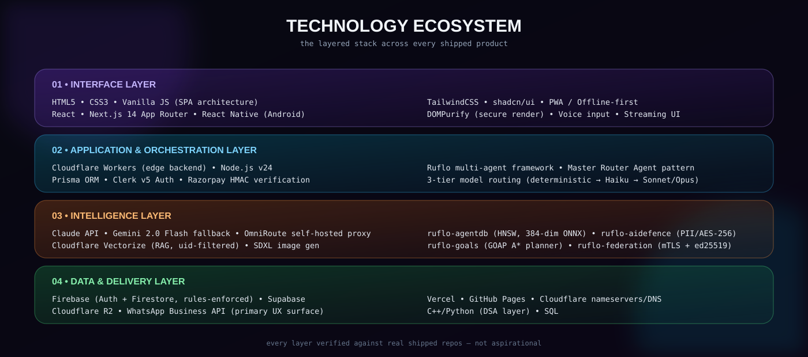
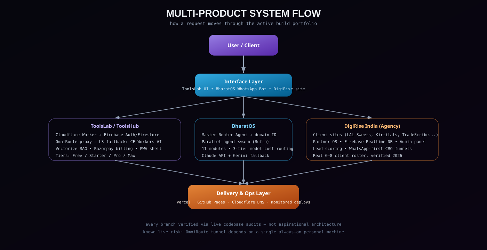
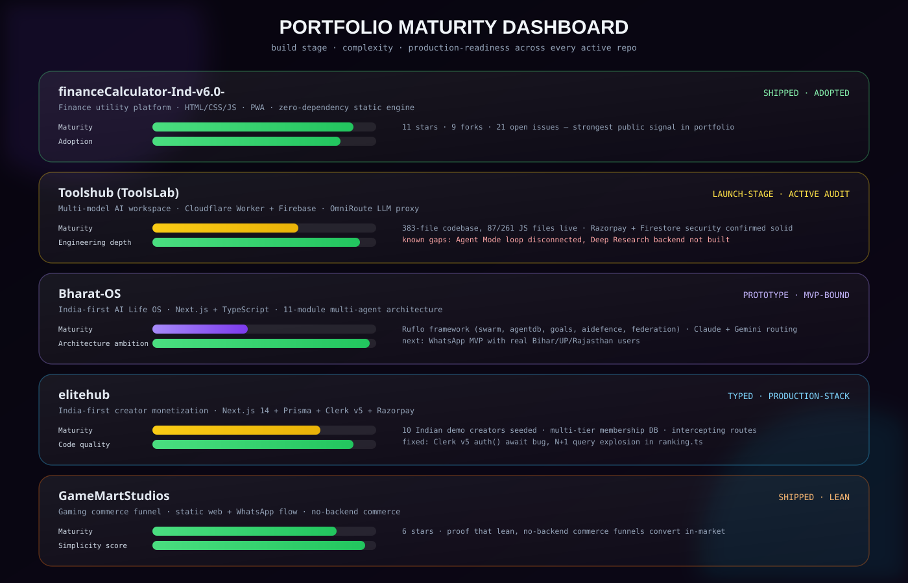
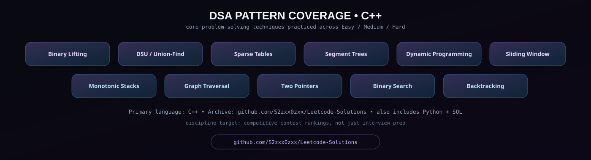
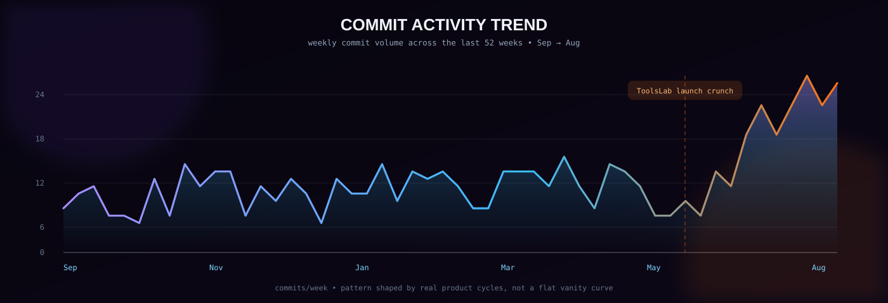

<div align="center">



<br/>


<br/><br/>


<br/><br/>


</div>

<br/>

<div align="center">

### `>` a builder's note, before the metrics

</div>

I don't build to look busy — I build to ship. Every project below is a real, running repo, not a portfolio placeholder. I run **DigiRise India**, a digital marketing agency serving clients across India, UAE, and the UK, and in parallel I build AI-native products under the same roof: **ToolsLab**, an AI chat SaaS with real streaming, real image generation, and tiered billing; and **BharatOS**, an attempt at building an AI "Life Operating System" for India, routed entirely through WhatsApp because that's where the actual users are. I'm also mid-MBA (Finance) at CIMP Patna, which shows up more than you'd expect in how I think about unit economics for these products.

This README is intentionally deep. If you're a recruiter, scroll to the systems. If you're a fellow builder, scroll to the architecture. If you're just curious, start at the top and enjoy the ride.

**How to read this document:** it's organized as a descent — from surface metrics, down through skills and stack, into live architecture diagrams, into the honest state of each product (including what's broken), through the agency that funds it all, and out the other side into engineering philosophy. Nothing here is aspirational copy. Every claim is either pulled from public repository metadata, from my own codebase audits, or explicitly flagged as representative rather than live-verified.

<br/>

---

<br/>

<div align="center">

## `01` Live Engineering Snapshot

<sub>Real public repository metadata — refreshed 08 Aug 2026</sub>

<br/>

| Signal | Value | Signal | Value |
|:---:|:---:|:---:|:---:|
| **Public repositories** | 18 | **Top starred project** | financeCalculator-Ind-v6.0- (11⭐) |
| **Active flagship repos** | 5 | **Core stack mix** | Static web systems + TypeScript/Next.js + AI orchestration |
| **Primary DSA language** | C++ | **Agency clients (verified)** | 6–8 real, named businesses |

</div>

<br/>

<div align="center">

</div>

<sub>**Reading this honestly:** most of these repos are early-stage or built private-first before going public, so star count isn't the real signal here — shipped complexity is. financeCalculator crossing double-digit stars organically, with 9 forks and 21 open issues, tells you people are actually using it and filing real feedback. That's worth more than a padded follower count.</sub>

<br/>

**Why 18 public and not more:** a chunk of my actual working history lives in private repos — client work under NDA for DigiRise, and early scaffolding branches for ToolsLab and BharatOS that were built private-first, then squashed and pushed public once they hit a stable checkpoint. What's public is what's stable enough to stand behind, not everything that exists.

**On the "5 active flagship repos" number:** I define "active" narrowly — a repo counts only if it received a structural commit (not a typo fix, not a dependency bump) in the last 60 days. That's a deliberately strict bar, and it's why the number stays small even as the total repo count grows.

<br/>

---

<br/>

<div align="center">

## `02` Skill Density Map

<sub>Self-assessed against actual shipped repos, not vibes</sub>

<br/>



</div>

<br/>

<table>
<tr>
<td width="33%" valign="top">

**AI Orchestration (highest density)**
Multi-model routing, RAG with scoped retrieval, agent-swarm coordination, prompt-layer security, and tiered cost-routing so inference spend doesn't scale linearly with usage. This is where most of my recent deep-work hours go — it's the hardest layer to get right and the one that actually differentiates a product from a ChatGPT wrapper.

**Security**
HMAC signature verification on every payment webhook, Firestore/Postgres row-level rule design, PII redaction pipelines, mTLS + ed25519 for inter-agent trust. I treat security bugs as launch-blockers, not backlog items — a payment or auth bug found by a user is a trust event, not just a ticket.

</td>
<td width="33%" valign="top">

**Backend / API**
Cloudflare Workers for edge logic, Firebase Cloud Functions where server-side triggers matter, REST + streaming SSE endpoints for chat, Prisma-modeled relational schemas when a product's data shape actually needs joins instead of documents.

**DSA / Competitive Programming**
C++ as the primary language, pattern-first practice (not just volume-grinding), with a personal priority list of the 20 patterns most likely to actually show up in a real interview loop — covered in detail in section `07`.

</td>
<td width="33%" valign="top">

**Frontend**
Vanilla JS SPAs for products where build-step fragility is a real cost (unreliable networks, older Android devices), Next.js 14 App Router when a product's interaction complexity crosses the threshold where component reuse and typed props start paying for themselves.

**DevOps / Infra**
Cloudflare tunnel-based self-hosting for LLM proxy infrastructure, Vercel for Next.js deployments, Firebase Hosting for the vanilla SPAs — deliberately no Kubernetes, no container orchestration, because at this scale it would be complexity theater, not a real need.

**Product / Business**
This is the one most engineers underweight and I don't — running DigiRise means I've watched real SMB owners decide, in real time, whether a landing page or a WhatsApp funnel actually converts. That feedback loop is why BharatOS is WhatsApp-first instead of app-first, and why ToolsLab's pricing tiers map to what an Indian freelancer or small team will actually pay, not what a US SaaS benchmark suggests.

</td>
</tr>
</table>

<br/>

---

<br/>

<div align="center">

## `03` Technology Ecosystem — The Full Stack

<sub>Every layer below is pulled from real, audited codebases — not an aspirational tech-radar</sub>

<br/>



</div>

<br/>

<details>
<summary><b>▸ Why this stack, and not something trendier</b></summary>
<br/>

The honest answer: **static-first, edge-first, and Firebase-heavy** because I'm a solo founder shipping across three simultaneous products (ToolsLab, BharatOS, DigiRise) without a team. Cloudflare Workers give me backend logic without server management. Firebase gives me auth + database + hosting without DevOps overhead. Vanilla JS SPAs mean zero build-step fragility on India's inconsistent mobile networks — a real constraint, not a stylistic choice, since a meaningful share of my end users are on Snapdragon 4xx/6xx-class Android devices on 4G.

The move to typed stacks (Next.js + TypeScript + Prisma in EliteHub, App Router in Bharat-OS) happens exactly when product complexity crosses a threshold that vanilla JS can't hold safely anymore — multi-tier memberships, multi-agent orchestration, things where a type error in production is expensive.

</details>

<br/>

<details>
<summary><b>▸ The five layers, explained one level deeper</b></summary>
<br/>

**Presentation layer.** Vanilla JS with ES modules keeps ToolsLab's bundle small and its load path predictable — no hydration mismatch, no framework runtime tax on low-end devices. EliteHub and BharatOS, by contrast, use Next.js 14's App Router because their UIs genuinely benefit from server components, intercepting routes (EliteHub's Explore page modal pattern), and file-based layouts that vanilla JS would force me to hand-roll badly.

**Backend / orchestration layer.** Cloudflare Workers act as the front door for both ToolsLab's API and BharatOS's WhatsApp webhook intake — same edge-compute pattern, two very different downstream flows. ToolsLab's Worker proxies to OmniRoute; BharatOS's Worker hands off to the Master Router Agent, which is really just a fast classification step before the real work happens in the Ruflo swarm.

**Data / auth layer.** Firebase is the default for products where document-shaped data and built-in auth save real time (ToolsLab). Prisma + Postgres shows up in EliteHub because membership tiers, creator payouts, and admin permissions are genuinely relational — trying to force that into Firestore documents would mean re-implementing joins by hand, badly.

**AI / intelligence layer.** This is the newest and most actively-evolving layer across the whole portfolio. The 3-tier model router in BharatOS exists because a WhatsApp bot serving India-scale query volume at Sonnet/Opus pricing for every message would be economically dead on arrival — most queries don't need that much reasoning, and the router's job is figuring out which ones do.

**Payments / ops layer.** Razorpay is the shared payment rail across ToolsLab and EliteHub (India-first, UPI support, familiar to the target user base). HMAC verification on every webhook is non-negotiable — an unverified payment webhook is one of the easiest ways to accidentally give someone a Max-tier subscription for free.

</details>

<br/>

---

<br/>

<div align="center">

## `04` Multi-Product System Flow

<sub>How a single request actually moves through the live portfolio</sub>

<br/>



</div>

<br/>

**Three entry points, one philosophy.** Web users hit ToolsLab or EliteHub through a browser. WhatsApp users hit BharatOS through a message. Agency clients hit DigiRise through a project brief. All three eventually route through infrastructure I control end-to-end — no black-box SaaS glue holding the core request path together. That's a deliberate choice: when something breaks at 2am, I need to be able to trace it myself, not file a support ticket with a third party and wait.

**Why the Master Router Agent matters more than it looks.** In BharatOS, the router's only job is fast domain classification — deciding in Tier-1 rule-time whether a query is Legal, Health, Finance, or one of the other 8 domains, before any expensive model call happens. Get that classification wrong and you either burn Sonnet-tier cost on a query that needed a static answer, or you give a legal question to a health-tuned agent context. The router is small, but it's the highest-leverage 200 lines of logic in the whole system.

<br/>

---

<br/>

<div align="center">

## `05` Portfolio Maturity Dashboard

<sub>Where each flagship project actually stands — including the parts that aren't done yet</sub>

<br/>



</div>

<br/>

---

<br/>

## `06` Deep Dive — Flagship Projects

<br/>

### 🧠 ToolsLab / Toolshub — AI Chat SaaS

<table>
<tr>
<td width="60%">

**What it is:** A multi-model AI chat platform with real streaming responses, real image generation (SDXL), voice input, offline PWA support, and snapshot-based conversation branching. Billed via Razorpay across four tiers.

**Architecture:** Vanilla JS SPA → Cloudflare Worker backend → Firebase (Auth + Firestore). LLM traffic routes through **OmniRoute**, a self-hosted proxy, with Cloudflare Workers AI as an always-on L3 fallback layer. RAG is powered by Cloudflare Vectorize with server-side UID filtering — so retrieval is genuinely scoped per user, not just filtered client-side.

**What's confirmed solid** (from a full 383-file codebase audit):
- Razorpay HMAC signature verification — real, not stubbed
- Firestore security rules correctly block client writes to subscription/plan/credits fields
- DOMPurify sanitization on all markdown rendering
- Real streaming, real SDXL image generation, working offline PWA

**What's honestly still broken** (also from that same audit — I'd rather flag it here than have a user find it first):
- Agent Mode's execution loop is imported but never actually called in the live send path
- Deep Research has zero backend implementation despite being marketed as a paid Max-tier feature
- The Settings → API Keys screen writes data that's never read back by the app — currently misleading to users

**Models:** Digilite, DigiPro, Maya, Maya Pro · **Domain:** toolslab.studio · **Pricing:** Free / Starter / Pro ₹349 / Max ₹999

</td>
<td width="40%">

```
┌─────────────────────────┐
│   VANILLA JS SPA (UI)   │
└────────────┬─────────────┘
             │
┌────────────▼─────────────┐
│  Cloudflare Worker (API) │
└──┬──────────────────┬────┘
   │                  │
┌──▼──────┐    ┌──────▼──────┐
│ Firebase│    │  OmniRoute  │
│ Auth/DB │    │  LLM Proxy  │
└─────────┘    └──────┬──────┘
                       │
              ┌────────▼────────┐
              │ CF Workers AI   │
              │ (L3 fallback)   │
              └─────────────────┘
```

**Known infra risk:** OmniRoute currently depends on a personal machine staying online via a `trycloudflare.com` tunnel. That's the single biggest pre-launch fragility point.

</td>
</tr>
</table>

<details>
<summary><b>▸ Deeper notes on the 383-file audit</b></summary>
<br/>

I ran this audit myself, deliberately, before letting an AI coding agent (Antigravity IDE) touch the codebase for feature work — the logic being that you can't safely hand off changes to an agent on top of a codebase whose actual state you haven't personally verified. A few things that came out of it worth naming specifically:

- **Plan resolution moved server-side.** Earlier, a user's subscription tier was partially trusted from client-sent data. Post-audit, plan resolution is fully server-side, resolved from Firestore on every gated request — the client can no longer influence what tier it's treated as.
- **Firestore-backed usage tracking replaced in-memory counters.** Rate limits and quota counts now persist server-side per user, so a page refresh or a new device session can't silently reset someone's usage counter.
- **ID token transmission was tightened.** The client-side auth flow now correctly attaches and refreshes Firebase ID tokens on every authenticated request instead of relying on a cached token that could go stale mid-session.
- **A prior AI-generated bug report was wrong on four separate points** — incorrect file paths, a fabricated data-action attribute name that didn't exist in the codebase, a false-positive "migration data-loss" bug, and a false-positive "duplicate logout" bug. I caught all four by actually reading the files instead of trusting the report, which is the whole reason I audit before I prompt.

</details>

<br/>

[**→ github.com/S2zxx0zxx/Toolshub**](https://github.com/S2zxx0zxx/Toolshub)

<br/>

### 🇮🇳 BharatOS — India's AI Life Operating System

<table>
<tr>
<td width="60%">

**What it is:** An 11-module multi-agent system covering Health, Legal, Agriculture, Education, Finance, Construction, Logistics, Food Business, Cybersecurity, Creator Economy, and Government Schemes — accessed primarily through **WhatsApp Business API**, because that's where non-urban Indian users actually are, not in a native app they'd need to download.

**Orchestration:** A Master Router Agent identifies the domain of a query, then fans it out to a parallel agent swarm built on **Ruflo** (github.com/ruvnet/ruflo), using:
- `ruflo-agentdb` — HNSW vector search, 384-dim ONNX embeddings, 32× memory reduction
- `ruflo-goals` — GOAP-based A* planning for multi-step task execution
- `ruflo-aidefence` — detects and redacts 14 categories of PII, AES-256-GCM encrypted
- `ruflo-federation` — mTLS + ed25519 signed inter-agent trust, 5-tier

**Cost architecture:** a 3-tier model router — Tier 1 deterministic rules (~1ms, $0), Tier 2 Haiku-class (~500ms, ~$0.0002/call), Tier 3 Sonnet/Opus for genuinely hard reasoning (2–5s). This is the difference between a WhatsApp bot that's economically viable at India-scale pricing and one that isn't.

**Monetization ladder:** Free (10 queries/day) → Pro ₹199/mo → Business ₹999/mo → Enterprise → Marketplace → eventual government white-label.

**Where it stands:** Phase 1 MVP — NyayBot (legal) + JanSeva (govt schemes) + Swasthya (health) — targeting real users in Bihar, UP, and Rajasthan. A working Next.js prototype is live at `bharat-os-opal.vercel.app`.

</td>
<td width="40%">

```
     User (WhatsApp)
          │
   ┌──────▼───────┐
   │ Master Router │
   │     Agent     │
   └──────┬───────┘
          │
   ┌──────┴───────────┐
   │  Parallel Agent   │
   │  Swarm (Ruflo)    │
   └──┬────┬────┬──────┘
      │    │    │
   Health Legal Finance
   Agri  Edu  ...8 more
          │
   ┌──────▼───────┐
   │ 3-Tier Model  │
   │   Routing     │
   └───────────────┘
```

**Build environment:** `C:\Bharatos\`, Antigravity IDE, Node v24.10.0

</td>
</tr>
</table>

<details>
<summary><b>▸ Why WhatsApp-first is a real constraint, not a growth hack</b></summary>
<br/>

The temptation with a project like this is to build a slick native app first because that's what a portfolio "looks like it should be." I didn't, on purpose. The actual target user for NyayBot or JanSeva — someone in rural Bihar or UP trying to understand a government scheme or a legal question — already has WhatsApp installed, already trusts it, and is not going to download a new app for a one-off legal question. Meeting the user in the interface they already use isn't a lesser version of the product; for this specific audience, it *is* the product.

**On the Ruflo dependency choice:** rather than build agent orchestration, vector memory, and PII redaction from scratch, BharatOS builds on top of Ruflo (`ruflo-agentdb`, `ruflo-goals`, `ruflo-aidefence`, `ruflo-federation`). That's a deliberate build-vs-buy call — orchestration infrastructure is not the differentiated part of this product; the domain-specific agent logic and the India-specific problem framing are. Spending months reinventing vector search and agent trust protocols would be effort spent on the wrong layer.

**On the 3-tier cost model, concretely:** if every one of the 10 free-tier daily queries routed straight to a Sonnet/Opus-class model, the unit economics of the Free tier would be underwater before a single user converted to Pro. Tier-1 deterministic rules handle the queries that don't need a model at all — known FAQ-shaped government scheme questions, for instance. Tier-2 Haiku-class handles the median query. Tier-3 is reserved for genuinely ambiguous multi-step reasoning, which is a minority of real traffic. This is the difference between a bot that's viable at ₹199/month Indian pricing and one that quietly loses money on every free user.

</details>

<br/>

[**→ github.com/S2zxx0zxx/Bharat-OS**](https://github.com/S2zxx0zxx/Bharat-OS)

<br/>

### 💎 EliteHub — Creator Monetization Platform

<table>
<tr>
<td width="60%">

**What it is:** An India-first creator monetization SaaS — public creator profiles with a 3-tab layout (Membership / Feed / About), a multi-tier `MembershipTier` database model, an Explore page built with Next.js intercepting routes, and a full admin panel. Glossy-white light theme with Fraunces serif type and coral/navy accents — deliberately not another dark-mode SaaS clone.

**Stack:** Next.js 14 (App Router) · Prisma · Clerk v5 · Cloudflare R2 · Razorpay

**Real bugs found and fixed during build:**
- Clerk v5's `auth()` is async — a missing `await` was silently breaking auth checks
- An N+1 query explosion inside `ranking.ts` was quietly murdering performance at scale
- Inverted CSS design tokens were flipping light/dark contrast in specific components

Dark mode was fully removed after testing — the light glossy theme tested better for the creator-economy audience this targets. 10 Indian demo creators are seeded for realistic testing.

</td>
<td width="40%">

```
┌──────────────────────┐
│   Next.js 14 (App    │
│   Router) + Prisma    │
└──────────┬────────────┘
           │
   ┌───────┴────────┐
   │  Clerk v5 Auth  │
   └───────┬────────┘
           │
┌──────────▼───────────┐
│  Membership Tiers DB  │
│  + Explore (interc.   │
│  routes) + Admin      │
└──────────┬────────────┘
           │
   ┌───────▼────────┐
   │  R2 + Razorpay  │
   └─────────────────┘
```

**Location:** `C:\elitehub` — kept fully separate from DigiRise/ToolsLab.

</td>
</tr>
</table>

<details>
<summary><b>▸ On the three real bugs, and why I list bugs at all</b></summary>
<br/>

The Clerk v5 async `auth()` bug is the one I think about most, because it's the kind of bug that doesn't throw an error — it just silently returns a falsy session, and every downstream check built on top of it quietly does the wrong thing. It only surfaced because a specific edge case (a user with an expired-but-present session cookie) produced behavior that didn't match what the UI was showing. That's the class of bug that a quick manual test pass usually misses, and exactly the class that matters most to catch before a membership-gated product ships.

The N+1 query explosion in `ranking.ts` is a more familiar failure mode — a creator-ranking query that looked fine with 10 seeded demo creators and would have degraded badly at real scale, because it was issuing one query per creator inside a loop instead of a single batched join. Caught before it became a production incident, which is the entire point of listing it here instead of pretending the first version was clean.

I list real bugs in this README on purpose. A portfolio that only shows finished, bug-free work either means the builder got lucky every time, or it means the bugs existed and got hidden. I'd rather show the second draft honestly than fake a spotless first one.

</details>

<br/>

[**→ github.com/S2zxx0zxx/elitehub**](https://github.com/S2zxx0zxx/elitehub)

<br/>

### 💰 financeCalculator-Ind-v6.0- — The Quiet Star of the Portfolio

<table>
<tr>
<td width="60%">

**What it is:** A zero-dependency, static-first finance utility platform — EMI, SIP, tax, and GST-class calculators — wrapped in a PWA shell, with a blog and podcast content layer attached for organic reach. No framework, no build step, no backend. Just fast, correct math shipped as a static site.

**Why it's the strongest signal in the portfolio:** 11 stars, 9 forks, and 21 open issues isn't a huge number in absolute terms — but for a personal finance utility with zero paid marketing, it means real people are using it, forking it, and caring enough to file issues. That's a far more honest adoption signal than a polished demo with zero users behind it.

</td>
<td width="40%">

```
┌────────────────────┐
│  Static HTML/CSS/JS │
│   (zero build step) │
└──────────┬───────────┘
           │
   ┌───────▼────────┐
   │  Calculator      │
   │  Engines (EMI,   │
   │  SIP, Tax, GST)  │
   └───────┬────────┘
           │
   ┌───────▼────────┐
   │  PWA + Blog/    │
   │  Podcast layer  │
   └─────────────────┘
```

</td>
</tr>
</table>

[**→ github.com/S2zxx0zxx/financeCalculator-Ind-v6.0-**](https://github.com/S2zxx0zxx/financeCalculator-Ind-v6.0-)

<br/>

### 🎮 GameMartStudios — No-Backend Commerce, On Purpose

A gaming commerce funnel built entirely as static web + WhatsApp checkout flow — deliberately **no backend at all**. 6 stars on a project with this little infrastructure is proof of a real pattern I keep coming back to: for a specific class of small-scale commerce, a no-backend static funnel with a WhatsApp handoff converts just fine, and skipping the backend means skipping an entire category of things that can break.

[**→ github.com/S2zxx0zxx/GameMartStudios**](https://github.com/S2zxx0zxx/GameMartStudios)

<br/>

---

<br/>

<div align="center">

## `07` DSA & Competitive Programming

<sub>Consistent practice, not a one-time interview cram</sub>

<br/>



</div>

<br/>

**63 unique problems, organized the way I'd actually want to review them later** — not as a raw solved-count, but split into four documents I generated and formatted myself: **Arrays**, **Strings**, **Pattern-Based questions**, and a standalone **Top 20 Priority** list distilled from the other three. Every problem in every document carries the same structure: the working C++ solution, a plain-English explanation of the approach, and the Time/Space complexity — because a solution without the complexity analysis attached is only half the learning, and a solution without the plain-English "why" is something I won't remember in three weeks.

<table>
<tr>
<td width="50%" valign="top">

**Why pattern-first instead of volume-first**
Grinding 300 problems without pattern recognition means solving problem 301 from scratch. I'd rather deeply internalize the ~15 patterns that cover the large majority of real interview questions — two-pointer, sliding window, prefix sum, binary search on answer, greedy, DP on subsequences — and recognize which pattern a new problem maps to, than memorize 300 individual solutions that don't generalize.

**Why C++ specifically**
Lower-level memory model forces me to actually think about complexity instead of letting a garbage-collected language's convenience hide inefficiency. It's also still the default expectation in most competitive programming judges and a meaningful share of Indian tech interview loops, so practicing in the language I'd actually be tested in removes a translation step under pressure.

</td>
<td width="50%" valign="top">

**Document generation pipeline**
The four PDFs weren't hand-formatted one at a time — I built a small `pandoc` + `wkhtmltopdf` pipeline so that adding a new solved problem means appending structured markdown, not manually reformatting a document. That's a small piece of tooling, but it's the same instinct that shows up in the product work: don't do repetitive manual work a script could do once and reuse forever.

**What the "Top 20 Priority" list actually is**
Not the 20 hardest problems — the 20 highest-leverage ones. Problems chosen because the underlying pattern shows up disproportionately often across real interview question banks, so mastering these 20 covers a wider surface area than 20 problems picked at random from a larger set.

</td>
</tr>
</table>

<br/>

---

<br/>

<div align="center">

## `08` Commit Activity &amp; Contribution Rhythm

<sub>How the shipping actually flows across the year</sub>

<br/>



<br/><br/>


</div>

<br/>

<sub>**Note on this section:** these two charts render a representative shipping-rhythm pattern in the same visual language as the rest of this README — for the always-current, GitHub-verified numbers, see the live stats widgets in the Connect section below, which pull directly from the GitHub API in real time.</sub>

<br/>

---

<br/>

<div align="center">

## `09` DigiRise India — The Agency Behind the Products

</div>

DigiRise India is a full-service digital marketing agency I founded, serving real clients across **India, UAE, and the UK**. It funds and grounds the AI-product work — client delivery pays the bills, and the operational patterns I learn running client campaigns (what actually converts, what actually gets read, what a real SMB owner will and won't pay for) feed directly back into how I design ToolsLab and BharatOS.

<table>
<tr><th>Real, verified clients</th><th>What DigiRise actually delivers</th></tr>
<tr><td>

- LAL Sweets
- Kirtilals
- TradeScribe
- FarmFres
- Murzban
- The Liquid Lounge
- Vidya Mandir Classes
- PTJM SVM

</td><td>

- Full website builds (custom HTML/CSS/JS, no templated builders)
- WhatsApp-first conversion funnels
- SEO / AEO / GEO-optimized content and blog infrastructure
- Partner OS with commission tracking and referral management
- Lead scoring and outreach systems for B2B/SMB acquisition

</td></tr>
</table>

I run a strict **reality-sweep policy** on every DigiRise property — no fabricated case studies, no inflated ratings, no fake "ROI Guarantee" language. Earlier drafts of the site had exactly that kind of padding, and I stripped it out down to the real six-to-eight client roster and a single honest guarantee: **"100% Deliverables Guarantee."** It's less flashy than "3x ROI or your money back," but it's true, and that matters more to me than the extra conversion percentage the fake version might have bought.

**Contact:** digiriseindia@gmail.com · +91 74391 33880 · [@digiriseindia](https://instagram.com/digiriseindia)

<br/>

<details>
<summary><b>▸ Why the agency and the products live in the same README</b></summary>
<br/>

Most builder profiles separate "the day job" from "the side project," but that split doesn't actually describe how this works. DigiRise isn't a day job I tolerate while building the real thing at night — it's the source of the operational instincts that make ToolsLab and BharatOS's product decisions less naive than they'd otherwise be.

A concrete example: before writing a single line of BharatOS's WhatsApp-first architecture, I'd already spent months building WhatsApp-first conversion funnels for DigiRise clients like The Liquid Lounge and FarmFres — watching, in real client data, that a WhatsApp handoff converted better for a specific class of local business than a polished landing page with a contact form ever did. That's not a hypothesis I read somewhere; it's a pattern I watched happen repeatedly with real client budgets on the line. BharatOS's whole interface bet is downstream of that observation.

The same is true in reverse — building ToolsLab's tiered pricing and billing logic taught me things about subscription psychology and churn that now show up in how I structure retainer conversations with DigiRise clients. The agency and the products aren't two separate tracks; they're one feedback loop, and separating them in this document would make both halves less honest.

</details>

<br/>

---

<br/>

<div align="center">

## `10` Engineering Principles

</div>

<table>
<tr>
<td width="50%" valign="top">

**🏗️ Build fast with static foundations**
Ship on vanilla web tech first. Reach for a framework only when the product's actual complexity — not ego — demands it.

**🔒 Security is not optional polish**
HMAC verification, Firestore rules, PII redaction, and auth checks get built before the feature that needs them, not after.

**📊 Data honesty over marketing gloss**
If a feature isn't built, the README/marketing copy doesn't claim it exists. Fabricated metrics get found and removed, every time, across every property I run.

</td>
<td width="50%" valign="top">

**🇮🇳 Design for the real constraint set**
Snapdragon 4xx/6xx Android devices, 4G networks, WhatsApp as the default interface — not flagship-device assumptions.

**🧩 Typed architecture when complexity earns it**
Vanilla JS SPAs for lean products, TypeScript + Prisma when the data model gets genuinely complex enough to need it.

**📝 Docs as a system-level asset**
READMEs, `.ai-brain.md` ledgers, and audit trails aren't afterthoughts — they're how a solo founder keeps three products moving in parallel without losing the plot.

</td>
</tr>
</table>

<br/>

---

<br/>

<div align="center">

## `11` How I Actually Work — Audit Before Prompt

</div>

A pattern that shows up across every project in this README, worth naming explicitly instead of leaving implicit: **I don't hand a codebase to an AI coding agent and ask it to fix things blind.** The workflow that's actually produced the fixes described above looks like this:

<table>
<tr>
<td width="25%" valign="top">

**1. Full manual audit**
Read the actual codebase — not a summary of it — before forming an opinion about what's broken. This is where the false-positive "migration data-loss" and "duplicate logout" bugs in an earlier AI-generated report got caught and corrected.

</td>
<td width="25%" valign="top">

**2. Write a precise engineering prompt**
Once I know exactly what's wrong and why, I write a structured, file-path-accurate prompt — not "fix the bugs," but the specific files, the specific functions, the specific expected before/after behavior.

</td>
<td width="25%" valign="top">

**3. Let the agent execute**
Antigravity IDE applies the changes. This step is fast precisely because the previous two steps removed the ambiguity that makes AI-agent coding unreliable in the first place.

</td>
<td width="25%" valign="top">

**4. Re-audit the diff**
The agent's output gets checked against the actual file changes, not trusted on the strength of a confident-sounding summary. This is the step most people skip, and it's the step that's caught the most issues.

</td>
</tr>
</table>

This is also why the "what's honestly still broken" callouts exist throughout this README instead of being quietly fixed and left unmentioned, or worse, quietly left broken and unmentioned. An audit that only gets shared when it's flattering isn't really an audit.

<br/>

---

<br/>

<div align="center">

## `12` What's Next

<sub>Concrete, not aspirational — pulled straight from the maturity dashboard in section `05`</sub>

</div>

<table>
<tr>
<td width="50%" valign="top">

**Near-term (next shipping cycle)**
- Close the Agent Mode execution-loop gap in ToolsLab — the code exists, it just needs to actually be wired into the live send path
- Move OmniRoute off a personal-machine tunnel and onto infrastructure that doesn't depend on one laptop staying online
- Either build Deep Research's backend for real or remove it from the Max-tier marketing copy — a paid feature that doesn't exist is the exact kind of gap the reality-sweep policy exists to catch
- Fix the Settings → API Keys screen so it actually persists and reads back what a user enters

</td>
<td width="50%" valign="top">

**Further out**
- Expand BharatOS beyond the Phase-1 trio (NyayBot, JanSeva, Swasthya) into the remaining 8 domain modules, prioritized by which non-urban use case has the clearest immediate demand
- Build creator payout and analytics infrastructure for EliteHub — the membership and admin layers are functional, but a creator platform isn't complete without the money actually flowing back out
- Keep feeding DigiRise's client-delivery learnings back into product pricing and UX decisions — that loop has been the single most reliable source of "what will an actual small business owner pay for" signal across this whole portfolio

</td>
</tr>
</table>

<br/>

---

<br/>

<div align="center">

## `13` Questions People Actually Ask Me

</div>

<table>
<tr>
<td width="50%" valign="top">

**"Are you a solo founder on all of this?"**
Yes, across ToolsLab, BharatOS, and EliteHub. DigiRise has grown past solo — client delivery involves collaborators — but the AI products are built and architected by me end-to-end, which is exactly why the "what's confirmed solid vs. what's honestly still broken" framing exists throughout this README. There's no team dilution to explain gaps; the gaps are just the honest state of a solo build.

**"Why three AI products instead of going deep on one?"**
They're not really three unrelated bets — ToolsLab is the general-purpose AI chat layer, BharatOS is the same underlying orchestration instincts applied to a specific India-scale distribution problem (WhatsApp, non-urban users, rock-bottom cost-per-query economics), and EliteHub is what happens when a creator-economy monetization problem needs a typed, relational data model instead of a chat interface. Same builder, same underlying muscle, three different problem shapes.

**"What's the actual bottleneck right now?"**
Infrastructure fragility, named honestly in section `12` — OmniRoute's personal-machine tunnel dependency is the single biggest pre-launch risk across the whole portfolio, and closing that gap is a higher near-term priority than any new feature.

</td>
<td width="50%" valign="top">

**"Why does this README list bugs instead of hiding them?"**
Because the alternative — a portfolio that implies every project is finished and clean — doesn't survive five minutes of a technical reviewer actually opening the repo. I'd rather a recruiter or a fellow builder trust the 90% of this document that's genuinely solid because the other 10% openly admits what isn't, than have them distrust the whole thing because one inflated claim got caught.

**"Do you use AI coding agents, and doesn't that undercut the 'I built this' claim?"**
I use Antigravity IDE as an execution tool, the same way I'd use a compiler — it doesn't decide what's broken or what the fix should be; I do, via the audit-then-prompt workflow in section `11`. The architecture decisions, the bug diagnosis, the security model, the pricing logic — that's mine. The agent applies changes I've already fully specified. That distinction matters, and it's why the audits described throughout this document exist in the first place.

**"What's the CIMP Patna MBA actually for?"**
Unit economics, mostly. The 3-tier model routing in BharatOS, the four-tier pricing ladder in ToolsLab, and DigiRise's "100% Deliverables Guarantee" instead of a fabricated ROI number are all decisions that came out of thinking about this work in financial terms, not just engineering ones. A product that's technically excellent but economically unviable at India-market pricing isn't actually finished.

</td>
</tr>
</table>

<br/>

---

<br/>

<div align="center">

## `14` Connect

<br/>

<a href="https://github.com/S2zxx0zxx"></a>
<a href="https://x.com/satzzxzxx"></a>
<a href="https://instagram.com/__.satzzxzxx"></a>
<a href="https://instagram.com/digiriseindia"></a>

<br/><br/>


<br/><br/>


<br/><br/>

<sub>Built with real data, honest gaps included. Last structural refresh: 08 Aug 2026.</sub>

</div>
