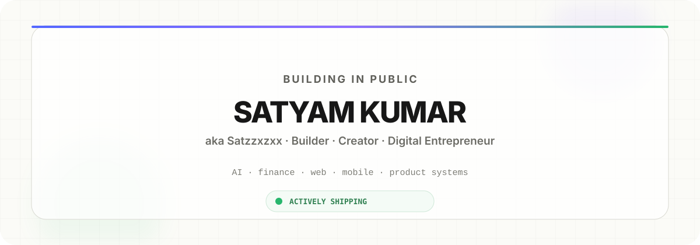
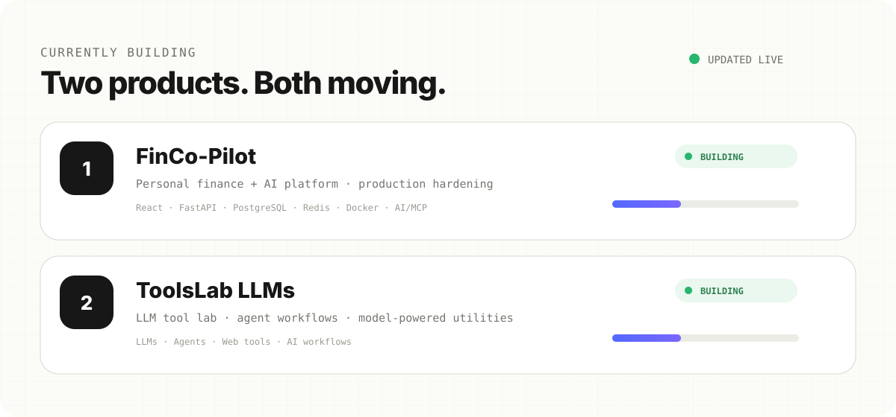
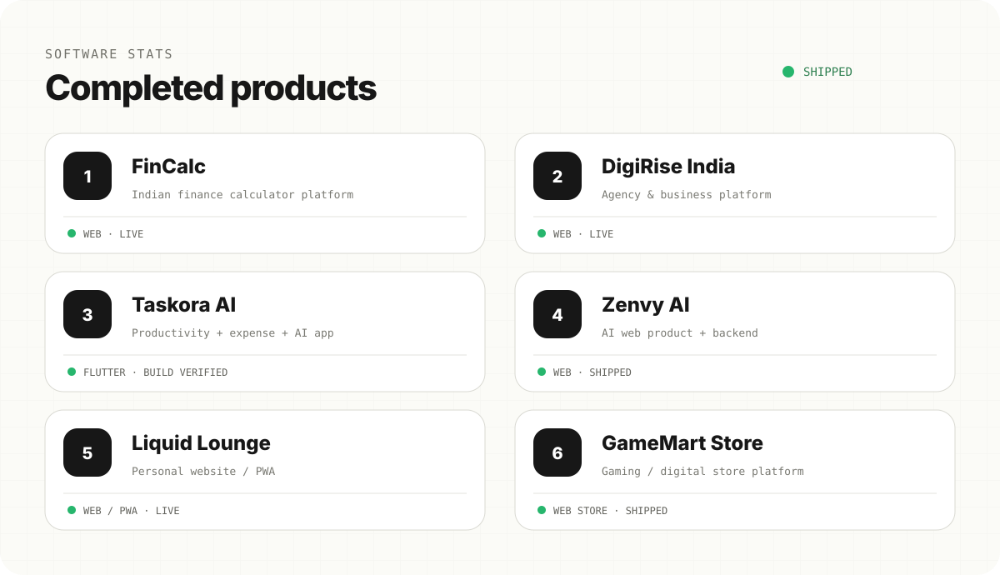
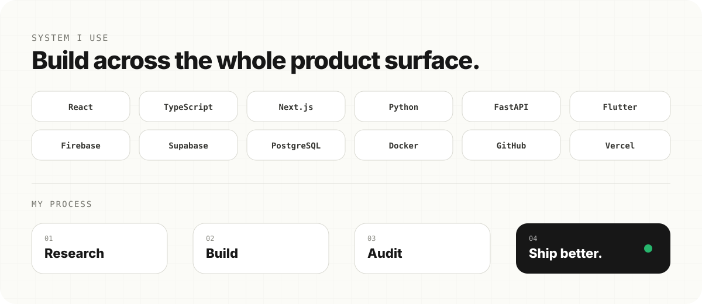

 

 

 

## `01` About the builder

I’m **Satyam Kumar**, also known as **Satzzxzxx** — a builder, creator, and digital entrepreneur working across **AI tools, finance products, productivity apps, business websites, and digital growth systems**.

I care more about **useful work, shipped products, and visible progress** than loud claims. My workflow is simple: understand the problem, build the product, audit it hard, then ship a better version.

I also build and grow **DigiRise India**, while continuously experimenting with software products of my own.

<table>
<tr>
<td width="25%" align="center"><b>48</b> repositories mapped public + private</td>
<td width="25%" align="center"><b>2</b> products currently building</td>
<td width="25%" align="center"><b>6</b> shipped products highlighted</td>
<td width="25%" align="center"><b>Web · Mobile · AI</b> core product surface</td>
</tr>
</table>

> This profile is intentionally current-first. Old metrics, stale architecture claims, and vanity numbers were removed in favor of what I’m actually building and shipping now.

 

---

 

## `02` Currently building

### **FinCo-Pilot** — personal finance + AI platform

A privacy-first finance cockpit for accounts, transactions, imports, categorization, budgets, goals, reports, shared expenses, invoices, multi-currency, bank integrations, backup/restore, and optional AI workflows.

`React` · `TypeScript` · `Vite` · `FastAPI` · `PostgreSQL` · `Redis` · `Celery` · `Docker` · `AI/MCP/RAG`

**Current phase:** production hardening, audit, polish, and release preparation.  
**Repository:** [`S2zxx0zxx/FinCo-pilot`](https://github.com/S2zxx0zxx/FinCo-pilot)

 

### **ToolsLab LLMs** — practical LLM product lab

An AI/LLM product focused on useful model-powered tools, agent workflows, research utilities, and practical automation. The public codebase currently lives under the **Toolshub** repository while the product identity evolves toward ToolsLab LLMs.

`LLMs` · `Agents` · `AI workflows` · `Web tools` · `Product systems`

**Current phase:** active product development and launch-readiness cleanup.  
**Repository:** [`S2zxx0zxx/Toolshub`](https://github.com/S2zxx0zxx/Toolshub)

<b>Why only two projects are shown as “building”</b>

 

Because “currently building” should mean exactly that. Older experiments, archived ideas, private work, and maintenance-only repositories stay out of this section even if they contain substantial code. The profile should show the work receiving active product attention now — not everything I have ever touched.

 

---

 

## `03` Shipped products

<table>
<tr>
<td width="50%" valign="top">

### **FinCalc**
Indian finance calculator platform built around practical money calculations, finance content, SEO, and a lightweight public web experience.

[`Public repository`](https://github.com/S2zxx0zxx/financeCalculator-Ind-v6.0-)

</td>
<td width="50%" valign="top">

### **DigiRise India**
Business and digital-agency platform for services, content, work, brand presence, and growth-oriented web experiences.

[`Public repository`](https://github.com/S2zxx0zxx/DigiRise-India)

</td>
</tr>
<tr>
<td width="50%" valign="top">

### **Taskora AI**
Flutter productivity app spanning tasks, groceries, expenses, calculator workflows, local persistence, and AI-oriented utilities.

`Private product · build/test evidence documented`

</td>
<td width="50%" valign="top">

### **Zenvy AI**
AI-focused web product with a dedicated backend, PWA support, deployment configuration, and a focused product experience.

[`Public repository`](https://github.com/S2zxx0zxx/Zenvy-AI)

</td>
</tr>
<tr>
<td width="50%" valign="top">

### **Liquid Lounge**
A polished personal/static web experience with PWA capabilities, service-worker support, custom-domain plumbing, and clean deployment architecture.

[`Public repository`](https://github.com/S2zxx0zxx/liquid-lounge)

</td>
<td width="50%" valign="top">

### **GameMart Store**
Gaming and digital-store product focused on a direct, product-first shopping experience.

`Private product`

</td>
</tr>
</table>

 

---

 

## `04` Featured five

These are the projects I currently consider the strongest representation of my work — ranked by a mix of product value, engineering depth, completeness, and what I want to build next.

| Rank | Product | What it represents | Current state |
|:--:|---|---|---|
| **01** | **FinCo-Pilot** | Full-stack personal finance + AI system | 🟢 Building / hardening |
| **02** | **FitTrackAI** | AI fitness & nutrition product | ✅ Build + tests documented |
| **03** | **ToolsLab LLMs / Toolshub** | Multi-tool AI / LLM product system | 🟢 Building |
| **04** | **DigiRise India** | Real business / agency web platform | ✅ Shipped |
| **05** | **FinCalc** | Finance tools + content platform | ✅ Shipped |

FitTrackAI is private, so this profile describes it without exposing private source.

 

---

 

## `05` System I use

### Core product stack

 

I choose tools based on the product rather than forcing every idea into one stack. The current pattern is:

- **Frontend / product UI:** React, TypeScript, Next.js, Vite, Flutter
- **Backend / APIs:** Python, FastAPI, serverless functions, API-oriented services
- **Data / auth:** PostgreSQL, Firebase, Supabase
- **Infra / delivery:** Docker, GitHub Actions, Vercel, GitHub Pages
- **AI:** LLM integration, agent workflows, MCP/RAG experiments, model-powered utilities
- **Product growth:** SEO, content systems, analytics thinking, business positioning

 

---

 

## `06` Learning in public

I use real projects as the classroom. The areas I’m deliberately improving right now are:

<table>
<tr>
<td width="20%" align="center"><b>AI Agents</b> LLM systems & workflows</td>
<td width="20%" align="center"><b>Backend</b> scalable product architecture</td>
<td width="20%" align="center"><b>Security</b> hardening & launch safety</td>
<td width="20%" align="center"><b>Product Design</b> UI, motion, hierarchy</td>
<td width="20%" align="center"><b>SEO & Growth</b> discovery & distribution</td>
</tr>
</table>

### `Research → Build → Audit → Ship`

**Research deeply. Build fast. Audit hard. Ship better.**

That loop is the center of how I work. A project is not “done” because the UI looks finished — it needs to survive testing, architecture review, security checks, edge cases, real deployment, and user feedback.

 

---

 

## `07` More from the lab

Not every repository belongs in the flagship list. Some are experiments, learning builds, utilities, data/code collections, recovery projects, or older product directions. A few notable public ones:

<b>AI / product experiments</b>

 

- [`Bharat-OS`](https://github.com/S2zxx0zxx/Bharat-OS) — Next.js AI-oriented product experiment using Gemini/Supabase-era architecture.
- [`bribes-fyi`](https://github.com/S2zxx0zxx/bribes-fyi) — clean Next.js information/transparency-style web project.
- [`elitehub`](https://github.com/S2zxx0zxx/elitehub) — broader product/platform experiment.
- [`OmniRoute-Satzzxzxx`](https://github.com/S2zxx0zxx/OmniRoute-Satzzxzxx) — large routing/tooling codebase kept separate from the flagship product story.
- [`codebase-memory-mcp-Satzzxzxx`](https://github.com/S2zxx0zxx/codebase-memory-mcp-Satzzxzxx) — codebase-memory / MCP-oriented tooling repository.

<b>Web / business / creative builds</b>

 

- [`DigiRise-Portfolio`](https://github.com/S2zxx0zxx/DigiRise-Portfolio)
- [`DigiRise-Admin-beta-`](https://github.com/S2zxx0zxx/DigiRise-Admin-beta-)
- [`Growpartner-Satzzxzxx`](https://github.com/S2zxx0zxx/Growpartner-Satzzxzxx)
- [`TravelTogether-v19`](https://github.com/S2zxx0zxx/TravelTogether-v19)
- [`scenicone`](https://github.com/S2zxx0zxx/scenicone)

<b>Learning / utility repositories</b>

 

- [`Leetcode-Solutions`](https://github.com/S2zxx0zxx/Leetcode-Solutions)
- [`MarketTrade-Insight-Ai`](https://github.com/S2zxx0zxx/MarketTrade-Insight-Ai)
- [`Flight-Fare-Prediction-Tool`](https://github.com/S2zxx0zxx/Flight-Fare-Prediction-Tool)
- [`Spam-Email-Detection-Software`](https://github.com/S2zxx0zxx/Spam-Email-Detection-Software)
- [`Image-Scraping-Advanced-2.0.1`](https://github.com/S2zxx0zxx/Image-Scraping-Advanced-2.0.1)

 

---

 

## `08` How I think about building

<table>
<tr>
<td width="33%" valign="top">

### Useful > impressive
A small product solving a real problem is more valuable than a complicated system built only to look advanced.

</td>
<td width="33%" valign="top">

### Evidence > claims
Build results, tests, deployment, audits, and actual product behavior matter more than a long technology list.

</td>
<td width="33%" valign="top">

### Iteration > perfection
Ship a solid version, inspect what breaks, learn from it, then make the next version meaningfully better.

</td>
</tr>
</table>

 

---

 

## `09` Find me

**Satyam Kumar · Satzzxzxx**  
Builder · Creator · Digital Entrepreneur

 

  

 

Profile redesigned around the same visual language as my live portfolio — warm minimal UI, product-first hierarchy, honest status, and build-in-public thinking.

