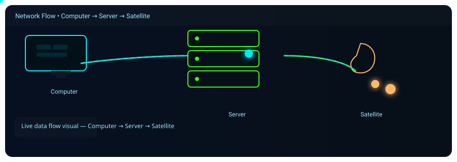
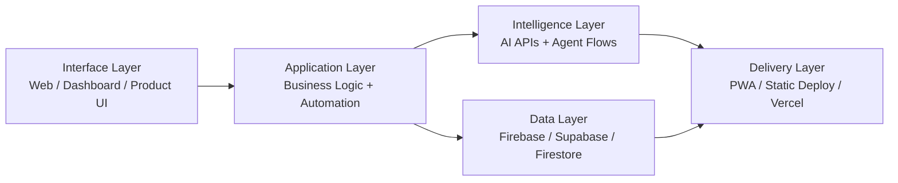

# Satyam Kumar · `S2zxx0zxx`
### Full-Stack Builder · Product Architecture Focus

---

## 01) Live Engineering Snapshot (Real GitHub Data)

> Last refreshed: **08 Aug 2026** (from public repository metadata)

| Signal | Value |
|---|---|
| Public repositories | **18** |
| Top starred project | **financeCalculator-Ind-v6.0- (11⭐)** |
| Active flagship repos | Toolshub, elitehub, Bharat-OS, Zenvy-AI, DigiRise-India |
| Core repo mix | Static web systems + TypeScript/Next.js apps + AI product workflows |

---

## 02) 3D System Wireframe View

  

### Architecture Spine

```mermaid
flowchart LR
    A[Interface Layer<br/>Web / Dashboard / Product UI] --> B[Application Layer<br/>Business Logic + Automation]
    B --> C[Intelligence Layer<br/>AI APIs + Agent Flows]
    B --> D[Data Layer<br/>Firebase / Supabase / Firestore]
    C --> E[Delivery Layer<br/>PWA / Static Deploy / Vercel]
    D --> E
```

---

## 03) Portfolio Intelligence Grid (Top Repos)

| Project | Domain | Stack | GitHub Signals |
|---|---|---|---|
| [financeCalculator-Ind-v6.0-](https://github.com/S2zxx0zxx/financeCalculator-Ind-v6.0-) | Finance utility platform | HTML, CSS, JS, PWA | **11⭐ · 9 forks · 21 open issues** |
| [Toolshub](https://github.com/S2zxx0zxx/Toolshub) | Multi-model AI workspace | JavaScript + workflow scripts | **1⭐ · active update Aug 2026** |
| [Bharat-OS](https://github.com/S2zxx0zxx/Bharat-OS) | India-first AI assistant OS | Next.js + TypeScript | **1⭐ · modular app architecture** |
| [elitehub](https://github.com/S2zxx0zxx/elitehub) | SaaS app base | Next.js + TS + Prisma + Tailwind | **typed production stack** |
| [Zenvy-AI](https://github.com/S2zxx0zxx/Zenvy-AI) | Zero-build AI SaaS OS | Vanilla web + Claude API + Firebase | **1⭐ · monetization-ready flow** |
| [DigiRise-Admin-beta-](https://github.com/S2zxx0zxx/DigiRise-Admin-beta-) | Partner operations dashboard | JS + Firebase Realtime DB | **1⭐ · KPI-driven admin surface** |
| [Leetcode-Solutions](https://github.com/S2zxx0zxx/Leetcode-Solutions) | DSA execution archive | C++, Python, SQL | **1⭐ · interview/contest discipline** |
| [scenicone](https://github.com/S2zxx0zxx/scenicone) | Premium brand website | HTML/CSS/JS | **1⭐ · conversion-first design** |
| [GameMartStudios](https://github.com/S2zxx0zxx/GameMartStudios) | Gaming commerce funnel | Static web + WhatsApp flow | **6⭐ · no-backend commerce** |
| [DigiRise-India](https://github.com/S2zxx0zxx/DigiRise-India) | Agency growth platform | HTML/CSS/JS + PWA | **multi-section growth site** |

---

## 04) Deep Architecture by Flagship Projects

### A) Toolshub · AI Platform Core
- **Presentation:** single workspace, modular interaction surfaces  
- **Orchestration:** multi-model routing style flows (Claude/GPT/Groq class usage pattern)  
- **Execution:** prompt → tool/action → response pipeline  
- **Ops:** docs/scripts oriented toward iterative product hardening

### B) elitehub · Typed Product Stack
- **Frontend:** Next.js 14 app router + component-first UI composition  
- **Security/Auth:** Clerk-ready auth envelope pattern  
- **Data:** Prisma-managed schema evolution pattern  
- **Reliability:** lint/test hooks + observability integrations (Sentry class setup)

### C) Bharat-OS · Domain-Driven AI Utility
- **Modules:** legal, schemes, finance, health, education style domain partitions  
- **Framework:** TypeScript app-folder architecture  
- **UX Intent:** Indian daily-use problem solving with multilingual accessibility direction  
- **System Goal:** practical AI OS layer for citizen workflows

### D) financeCalculator-Ind-v6.0-
- **Utility Engine:** multiple calculator pipelines (EMI/SIP/Tax/GST class tools)  
- **Content Engine:** blog + podcast info distribution structure  
- **Performance:** zero-dependency static system + PWA surface  
- **Scale Signal:** strongest public adoption signal in portfolio

### E) DigiRise-Admin-beta-
- **Control Plane:** partner + admin dual-surface architecture  
- **Business Logic:** commission slabs, referrals, progress tracking  
- **Data Layer:** Firebase rules-backed transactional state  
- **UI Layer:** KPI cards, insights, goal indicators

---

## 05) Engineering Principles

- Build fast with static foundations where possible  
- Move to typed architecture when product complexity rises  
- Keep design cinematic but functional (not decorative-only)  
- Treat README/docs as system-level product assets  
- Prioritize real utility, shipping velocity, and measurable outcomes

---

## 06) Connect

- GitHub: [@S2zxx0zxx](https://github.com/S2zxx0zxx)
- X: [@satzzxzxx](https://x.com/satzzxzxx)
- Instagram: [@__.satzzxzxx](https://www.instagram.com/__.satzzxzxx)
- Website: [satzzxzxx.me](https://satzzxzxx.me)

---

  
`Profile README rebuilt with real repo signals, architecture-first storytelling, and 3D wireframe presentation.`

